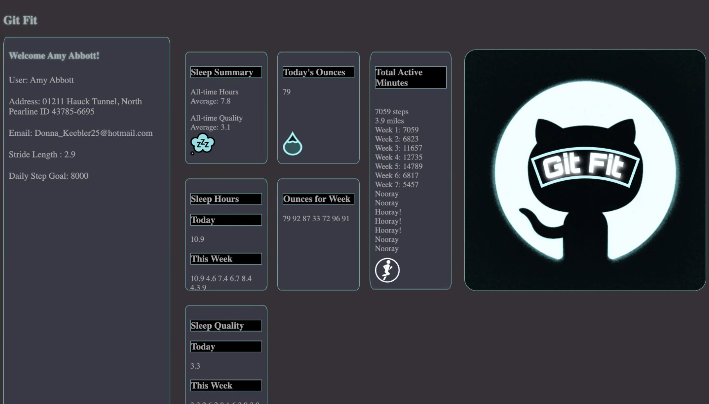

# README

## Description

Description: For this project our group built an application we named 'Git Fit'. It currently shows a randomized user and all that users data for different aspects of 'Getting Fit'. For each user there is a sleep column that displays the quality of sleep throughout the week and how many hours. The second column will deal with how many ounces have been drank by week and day. The final column displays the users activity levels, showing if they met their step goals for each week.

## Installation / Usage

Installation steps:  

1. Fork the GitHub Repository file (the word file should be a hyperlink).                                                                                                                                       

2. After initializing git inside the directory the user wants they can now clone their forked copy to their machine 

3. The user can now type 'npm install' into their terminal and hit enter. 

4. Then type 'npm start' into the same terminal. Now the user can open a new window in their terminal using 'cmd - t'.  

5. The user can now type open '**[http://localhost:8080/](http://localhost:8080/)**' into the new window in terminal to open up the application.

## Contributor  /  Links

Sharie Trashiel

[https://github.com/sdtrachsel](https://github.com/sdtrachsel)

Josua Martin

[https://github.com/jmartin777](https://github.com/jmartin777)

Johnathan Chaney

[https://github.com/cadechaney](https://github.com/cadechaney)

Isaiah Richardson

[https://github.com/CapCinematic](https://github.com/CapCinematic)

## Git Fit

