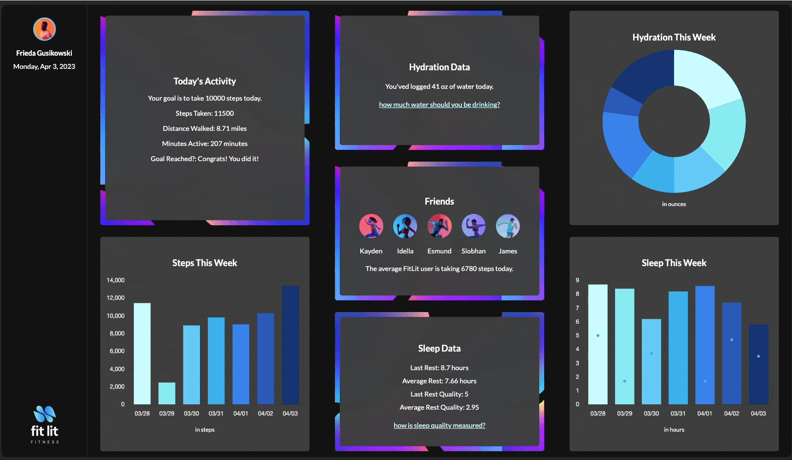

 

## About
Fit Lit is a locally-hosted, web-based application designed to help users track, log, and visualize their personalized fitness data. The dashboard-style interface allows users to access statistics in three broad categories-- activity, hydration, and sleep. Within each of these three categories, users can dig deeper to see information related to their daily, weekly, and all-time data.

---

## Set Up 

> ### Installing the files
> - Fork this [repository](https://github.com/RandyGitProjects/Fit-Lit) to your GitHub account. 
> - In your forked respository, click the `code` drop-down menu and copy the SSH key.
> - On your local machine, open the terminal using  `⌘ + space` and navigate to the location you'd like the flashcards repository directory cloned to. 
> - Once you're there, run `git clone [SSH Key] [Fit-Lit]` via the command line.
> - Run `npm install`. 

> ### Opening the application
> - When you're ready to use the app, open the terminal and navigate to the Fit-Lit directory via the terminal.
> - In the terminal, use command+t to open a new terminal tab. 
> - In the new terminal tab, run `npm start`.
> - Once WebPack has compiled the necessary resources, you will see a link within the text of your terminal. You can copy and paste that link into your browser to access a locally-hosted version of this application on your machine. 

---

## Preview

 

---

## Contributors
Randy Cisneros  [GitHub](https://github.com/RandyGitProjects) | [LinkedIn](https://www.linkedin.com/in/randy-cisneros-17006a191/)

Dustin Gouner  [GitHub](https://github.com/dustingouner) | [LinkedIn](https://www.linkedin.com/in/dustin-gouner/)

Em Lindvall  [GitHub](https://github.com/emlindvall) | [LinkedIn](https://www.linkedin.com/in/emilylindvall/)

Kelli Watkins [GitHub](https://github.com/klwats) | [LinkedIn](https://www.linkedin.com/in/kelli-watkins-1b73418b/)

---

## Context
This application was built while all colloborators were Mod 2 students at [Turing School of Software and Design Front End Web Development program](https://frontend.turing.edu/), a four- module, seven-month course focused on preparing students for a career as web developers working with Javascript, HTML, CSS, and the React framework. The application was built over the course of ten days, and completed with the [Project Specification and Rubric](https://frontend.turing.edu/projects/module-2/fitlit-part-one-agile.html) in mind.

