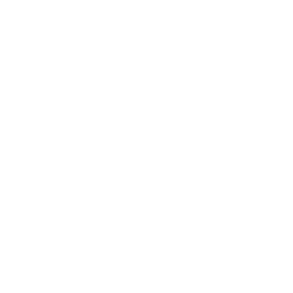

<a name="readme-top"></a>

## Contributors

[![Ian][ian-badge]][ian-url] [![Patt][patt-badge]][patt-url] [![Rae][rae-badge]][rae-url] [![Jordan][jordan-badge]][jordan-url]

<br />
<div align="center">
  <a href="https://github.com/github_username/repo_name">
    
  </a>

<h3 align="center">FitLit</h3>

  <p align="center">
    Fitness Tracking App
    <br />
    <a href="https://github.com/nordbyi/FitLit"><strong>Explore the docs »</strong></a>
    <br />
    <br />
    <a href="https://github.com/nordbyi/FitLit/issues">Report Bug</a>
    ·
    <a href="https://github.com/nordbyi/FitLit/issues">Request Feature</a>
  </p>
</div>

<details>
  <summary>Table of Contents</summary>
  <ol>
    <li>
      <a href="#about-the-project">About The Project</a>
      <ul>
        <li><a href="#built-with">Built With</a></li>
      </ul>
    </li>
    <li>
      <a href="#getting-started">Getting Started</a>
      <ul>
        <li><a href="#installation">Installation</a></li>
      </ul>
    </li>
    <li><a href="#roadmap">Roadmap</a></li>
  </ol>
</details>

## About The Project

[![Product Name Screen Shot][product-screenshot]](https://example.com)

We created a fitness tracking application that allows a user to see the information on their sleep/hydration/steps. Features added allows users to see all data displayed in a visually pleasing manner using charts from chart.js. The application also allows the user to take advantage of a calendar to manipulte dates to see a wide variety of information from different dates.

<p align="right">(<a href="#readme-top">back to top</a>)</p>

### Built With

- [![Javascript][javascript.js]][javascript-url]
- [![CSS][css]][css-url]
- [![HTML][html]][html-url]
- [![Webpack][webpack]][webpack-url]
- [![Chart.js][chart.js]][chart.js-url]
- [![API][api]][api-url]
- [![Mocha][mocha]][mocha-url]
- [![Chai][chai]][chai-url]
- [![Git][git]][git-url]
- [![GitHub][github]][github-url]

<p align="right">(<a href="#readme-top">back to top</a>)</p>

## Getting Started

### Installation

1. Fork the Repo from the [Repository](https://github.com/turingschool-examples/fitlit-starter-kit)
2. Clone the repo
   ```sh
   git clone git@github.com:nordbyi/FitLit.git
   ```
3. Install NPM packages
   ```sh
   npm install
   ```
4. Run npm start
   ```sh
   npm start
   ```
5. Use the Link that is given in the Terminal & Open in Browser
   ```sh
   Example: http://localhost:8080/
   ```

<p align="right">(<a href="#readme-top">back to top</a>)</p>

<!-- ROADMAP -->

## Roadmap

- [x] Daily Step Goal Chart
- [x] Daily Sleep Hours and Sleep Quality Chart
- [x] Weekly Chart for Sleep & Hydration
  - [x] Calendar to Choose Week the User wants to see

See the [open issues](https://github.com/nordbyi/FitLit/issues) for a full list of proposed features (and known issues).

<p align="right">(<a href="#readme-top">back to top</a>)</p>

[ian-badge]: https://img.shields.io/badge/-Ian%20Nordby-orange
[ian-url]: https://github.com/nordbyi
[patt-badge]: https://img.shields.io/badge/-Patt%20Sookmark-brightgreen
[patt-url]: https://github.com/pattpjy
[rae-badge]: https://img.shields.io/badge/-Rae%20Gebhart-blue
[rae-url]: https://github.com/rae-107
[jordan-badge]: https://img.shields.io/badge/-Jordan%20Smith-lightgrey
[jordan-url]: https://github.com/jaysmith2022
[mocha]: https://img.shields.io/badge/Mocha-FF2D20?style=for-the-badge&logo=mocha&logoColor=white
[mocha-url]: https://mochajs.org/
[chai]: https://img.shields.io/badge/Chai-20232A?style=for-the-badge&logo=chai&logoColor=61DAFB
[chai-url]: https://www.chaijs.com/
[webpack]: https://img.shields.io/badge/Webpack-563D7C?style=for-the-badge&logo=webpack&logoColor=white
[webpack-url]: https://webpack.js.org/
[chart.js]: https://img.shields.io/badge/Chart.js-35495E?style=for-the-badge&logo=chartdotjs&logoColor=4FC08D
[chart.js-url]: https://www.chartjs.org/
[css]: https://img.shields.io/badge/CSS-000000?style=for-the-badge&logo=css&logoColor=white
[css-url]: https://www.w3.org/Style/CSS/Overview.en.html
[html]: https://img.shields.io/badge/HTML-4A4A55?style=for-the-badge&logo=HTML&logoColor=FF3E00
[html-url]: https://www.w3schools.com/howto/howto_make_a_website.asp
[javascript.js]: https://img.shields.io/badge/JavaScript-0769AD?style=for-the-badge&logo=javascript&logoColor=white
[javascript-url]: https://www.javascript.com/
[api]: https://img.shields.io/badge/API-15EA75?style=for-the-badge&logo=HTML&logoColor=FF3E00
[api-url]: https://www.w3schools.com/js/js_api_intro.asp
[github]: https://img.shields.io/badge/GitHub-22043C?style=for-the-badge&logo=github&logoColor=FF3E00
[github-url]: https://github.com/
[git]: https://img.shields.io/badge/Git-2E0305?style=for-the-badge&logo=git&logoColor=FF3E00
[git-url]: https://git-scm.com/
