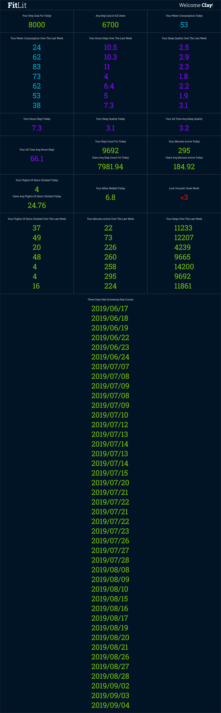

# FitLit

A Turing School of Software & Design Mod 2 paired project between Quinne Farenwald and Colin Koga. FitLit is a data activity tracker that tracks the (pre-populated) data of 50 separate users 3 months.

The data needed to be analyzed and manipulated with object and array prototype methods to display the desired information for the user. The dashboard displays data as if one user were to use the application. No comp was provided for the design of the dashboard. We decided on a simple, clean and modular text base layout.

ES6 classes communicate to each other as needed and keep the code separated and modularized for ease and organization. The code is also written modularly, following SRP. A robust testing suite using TDD helped enforce these principles. Information is displayed on the page while maintaining the ability to test class properties and methods.

## Visuals

## URL
https://ckoga.github.io/fitlit-starter-kit/src/index.html
